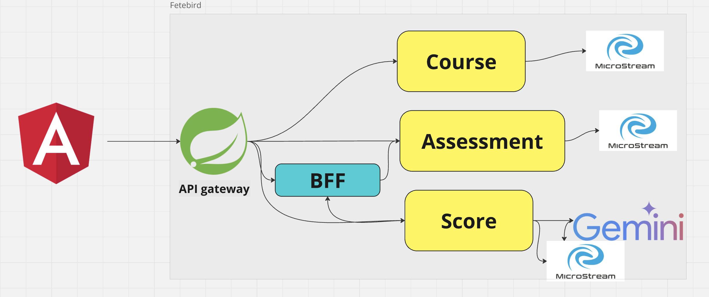

### Prerequisite
- Docker container
- Java 21
- Node.js
- Angular cli
- gcloud

### Architecture


### Authentication
KeyCloak is used for authentication. 
In the `service/authentication/falcon-keycloak` directory run the docker compose file.

``docker-compose -f keycloak-postgres-podman.yml up``

In the keycloak a `REALM` need to setup to run the angular application. check the `environment.ts` file for configuration.

This should run postgres and keycloak instance.

### Angular front-end
Run the angular application `web-ui` from the client directory using the below command

```ng serve -o```

### Back end 

Backend application are combination of below framework
- Micronaut
- Spring cloud gateway


#### Assessment 
This microservice is a micronaut application, used for assessment CRUD.

#### Course
This microservice is a micronaut application, used for course CRUD.

#### bff
This microservice is a micronaut application, used to modify the data for the front-end.

#### Score-ai
This microservice is a micronaut application + langchain4J, used to communicate with Gemini model and perform the action on the data. A gcloud vertexAi configuration is in the application.properties file

### Run the app
#### To run the application make sure below things are aligned
 - REALM should be configure in KeyCloak instance
 - Angular app should be running
 - Run all the microservices
 - Setup the Gcloud account and substitute the project_name, model_name and other
 - Make sure gcloud authentication is working fine
 - In the Gcloud enable all the apis and roles for the services
 

